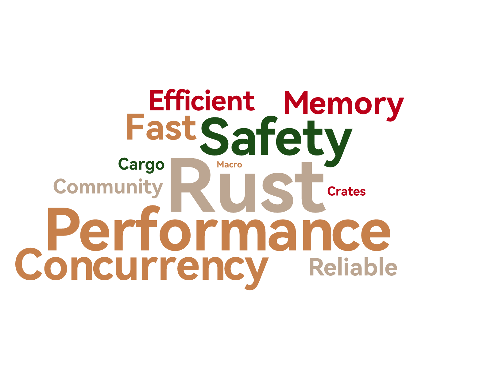

araea-wordcloud
===============

[](https://github.com/araea/araea-wordcloud)
[](https://crates.io/crates/araea-wordcloud)
[](https://docs.rs/araea-wordcloud)

A high-performance word cloud visualization library implemented in pure Rust.
Supports mask shapes, SVG/PNG dual output, custom fonts, and color schemes.

## Features

- ⚡ **Pure Rust Implementation** - Efficient collision detection using bit operations
- 🖼️ **Multiple Output Formats** - Export as vector graphics (SVG) or bitmap (PNG)
- 🎭 **Mask Support** - Built-in shapes and custom image masks
- 🎨 **Highly Customizable** - Custom fonts, colors, rotation angles, and spacing
- 📦 **Ready to Use** - Built-in Chinese font support

## Installation

```toml
[dependencies]
araea-wordcloud = "0.1"
```

## Quick Start

```rust
use araea_wordcloud::generate;
use std::fs;

fn main() -> Result<(), Box<dyn std::error::Error>> {
    let words = vec![
        ("Rust", 100.0),
        ("Fast", 80.0), 
        ("Safe", 60.0),
        ("WordCloud", 40.0),
    ];

    let wordcloud = generate(&words)?;
    fs::write("output.png", wordcloud.to_png(2.0)?)?;

    Ok(())
}
```

## Advanced Usage

```rust
use araea_wordcloud::{WordCloudBuilder, WordInput, ColorScheme, MaskShape};

let words = vec![
    WordInput::new("Love", 100.0),
    WordInput::new("Rust", 80.0),
];

let wordcloud = WordCloudBuilder::new()
    .size(800, 800)
    .background("#FFFFFF")
    .color_scheme(ColorScheme::Default)
    .mask_preset(MaskShape::Heart)
    .font_size_range(20.0, 100.0)
    .angles(vec![0.0, 90.0])
    .build(&words)?;
```

## Examples

### Simple Word Cloud


### Chinese Dense Word Cloud  


Run the examples:
- `cargo run --example simple` - Basic usage
- `cargo run --example mask_shape` - Heart-shaped word cloud
- `cargo run --example chinese_dense` - High-density Chinese word cloud
- `cargo run --example advanced` - Custom colors and layout

## Configuration Reference

### Color Schemes

| Scheme       | Style                    |
|--------------|--------------------------|
| `Ocean`      | Ocean blue-green (default) |
| `Sunset`     | Warm tones, red-orange-yellow |
| `Forest`     | Forest green, natural style |
| `Berry`      | Purple and bright orange |
| `Monochrome` | Black, white, and gray |
| `Rainbow`    | Rainbow colors |

### Preset Masks

| Shape       | Description        |
|-------------|--------------------|
| `Circle`    | Circle (default)   |
| `Heart`     | Heart shape        |
| `Cloud`     | Cloud shape        |
| `Star`      | Star shape         |
| `Triangle`  | Triangle           |
| `Skull`     | Skull shape        |

### Builder Options

| Method               | Description                  | Default           |
|----------------------|------------------------------|-------------------|
| `.size(w, h)`        | Canvas dimensions            | 800x600           |
| `.background(hex)`   | Background color             | #FFFFFF           |
| `.colors(vec![...])` | Custom color list            | Ocean Scheme      |
| `.font(bytes)`       | Custom font file data        | HarmonyOS Sans SC |
| `.mask(bytes)`       | Custom mask image            | None              |
| `.padding(px)`       | Word collision padding       | 2                 |
| `.word_spacing(px)`  | Word spacing                 | 4.0               |
| `.seed(u64)`         | Random seed (fixed layout)   | Random            |

## Acknowledgments

Thanks to [wordcloud.online](https://wordcloud.online/zh) for inspiration and reference.
The word cloud rendering approach is inspired by this website, achieving efficient and visually appealing results.

<br>

#### License

<sup>
Licensed under either of <a href="LICENSE-APACHE">Apache License, Version
2.0</a> or <a href="LICENSE-MIT">MIT license</a> at your option.
</sup>

<br>

<sub>
Unless you explicitly state otherwise, any contribution intentionally submitted
for inclusion in this crate by you, as defined in the Apache-2.0 license, shall
be dual licensed as above, without any additional terms or conditions.
</sub>
