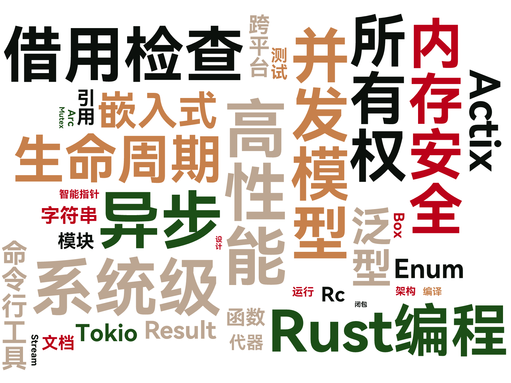
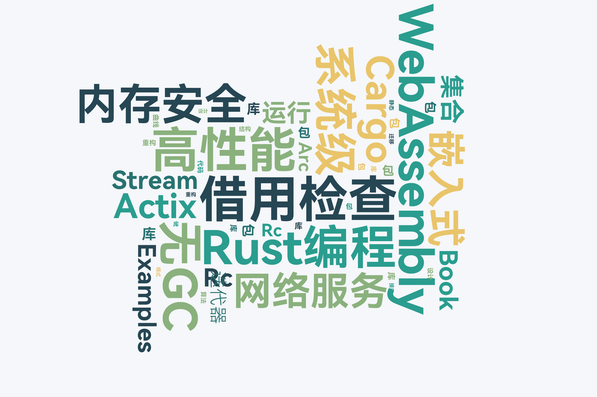

# araea-wordcloud

[](https://github.com/araea/araea-wordcloud)
[](https://crates.io/crates/araea-wordcloud)
[](https://docs.rs/araea-wordcloud)

Lay out weighted words and write the result as SVG or PNG. Each glyph is
rasterized into a bitmask and seated along an Archimedean spiral, so
collisions are pixel-exact.

- **Masks** — built-in shapes, or your own SVG / PNG / JPEG.
- **Vertical writing** — CJK words at ±90° stay upright and stack
  top-to-bottom, instead of the whole word tipping on its side.
- **Fonts** — ships HarmonyOS Sans SC Bold; pass any TTF/OTF.
- **Color** — seven presets, or your own hex list and background.
- **Reproducible** — optional seed. Words that do not fit are skipped.

## Installation

```toml
[dependencies]
araea-wordcloud = "0.1"
```

## Quick start

`generate` is the short path: tuples in, SVG or PNG out.

```rust
use araea_wordcloud::generate;
use std::fs;

fn main() -> Result<(), Box<dyn std::error::Error>> {
    let words = vec![
        ("Rust", 100.0),
        ("Fast", 80.0),
        ("Safe", 60.0),
        ("WordCloud", 40.0),
    ];

    let wordcloud = generate(&words)?;

    // `scale` multiplies the pixel size; 2.0 is a common HiDPI choice.
    fs::write("output.png", wordcloud.to_png(2.0)?)?;
    fs::write("output.svg", wordcloud.to_svg())?;

    Ok(())
}
```

Empty strings and non-positive weights are dropped. An empty list after
that filter is an error.

## Builder

Anything beyond the defaults goes through `WordCloudBuilder` and
`WordInput`.

```rust
use araea_wordcloud::{ColorScheme, MaskShape, WordCloudBuilder, WordInput};

fn main() -> Result<(), Box<dyn std::error::Error>> {
    let words = vec![
        WordInput::new("Love", 100.0),
        WordInput::new("Rust", 80.0),
        WordInput::new("Design", 60.0),
        WordInput::new("Code", 50.0),
    ];

    let wordcloud = WordCloudBuilder::new()
        .size(800, 800)
        .color_scheme(ColorScheme::Blue)
        .mask_preset(MaskShape::Heart)
        .font_size_range(20.0, 100.0)
        .angles(vec![-45.0, 0.0, 45.0])
        .padding(10)
        .build(&words)?;

    std::fs::write("heart_cloud.png", wordcloud.to_png(2.0)?)?;
    Ok(())
}
```

### Size and scale

`.size(w, h)` is the canvas in pixels, clamped to at least 100×100.
Default is 800×600. `to_svg()` is resolution-independent;
`to_png(scale)` multiplies that size.

### Color

`.color_scheme` replaces both the word colors and the background.
`.colors` only replaces the word colors; the background stays as it is
unless you also call `.background`. An empty color list falls back to
`ColorScheme::Default`.

| Scheme | Word colors | Background |
| --- | --- | --- |
| `Default` | dark green, crimson, bronze, taupe, forest | `#ffffff` |
| `Contrasting1` | orange, peach, off-white, cyan | `#000000` |
| `Blue` | teal, gold, sand, coral | `#ffffff` |
| `Green` | greens, cream, rust | `#ffffff` |
| `Cold1` | slate, grey, near-white, bronze | `#000000` |
| `Black` | `#000000` | `#ffffff` |
| `White` | `#ffffff` | `#000000` |

### Masks

No mask is applied by default — the full rectangle is usable.
`.mask_preset` picks a built-in SVG; `.mask` takes raw SVG, PNG, or
JPEG bytes.

A mask pixel is **blocked** (words cannot sit there) when it is
transparent (`alpha < 128`) or near-white (`R+G+B ≥ 750`). Dark,
opaque pixels are the drawable area. SVG masks are scaled to the
canvas on a white backdrop, so unpainted regions stay blocked.

| Shape | |
| --- | --- |
| `Circle` | circle |
| `Cloud` | cloud |
| `Heart` | heart |
| `Skull` | skull |
| `Star` | star |
| `Triangle` | triangle |

`MaskShape::Circle` is only the enum default. It is **not** applied
unless you call `.mask_preset`.

### Fonts and sizes

The default font is HarmonyOS Sans SC Bold. `.font(bytes)` accepts
TTF/OTF. `.font_size_range(min, max)` defaults to 10–100; `min` is
clamped to 4.

Weight is mapped linearly onto that range. Heavier words are placed
first.

### Rotation and vertical writing

`.angles` is the set each word draws from. Default is `[0.0]`
(horizontal). Other values rotate the whole word.

For upright CJK columns, put `90.0` or `-90.0` in the list and turn on
`.vertical_writing(true)`. Those words are not tipped on their side:
characters stack top-to-bottom and stay upright (`writing-mode:
vertical-rl`). Other angles still rotate the word as a unit.

```rust
let wordcloud = WordCloudBuilder::new()
    .angles(vec![0.0, 90.0])
    .vertical_writing(true)
    .build(&words)?;
```

### Spacing and seed

`.padding(px)` is extra collision margin around each glyph. Default is
5. `.seed(u64)` fixes the layout through ChaCha8; omit it for a new
layout each run.

Placement walks an Archimedean spiral from the center. If no gap is
found, that word is omitted from `WordCloud::words`.

## Output

```rust
let svg: String = wordcloud.to_svg();
let png: Vec<u8> = wordcloud.to_png(2.0)?;
```

`WordCloud` also exposes `width`, `height`, `background`, and the
placed words (`text`, `font_size`, `x`, `y`, `rotation`, `color`,
`is_vertical`).

## Examples

Each example writes `output_*.png` (and sometimes SVG) in the crate
root.

| Example | Shows |
| --- | --- |
| `simple` | `generate()`, PNG and SVG |
| `mask_shape` | heart mask, `ColorScheme::Default` |
| `advanced` | custom colors, background, and seed |
| `chinese_dense` | mixed CJK / English, default layout |
| `chinese_vertical` | ±90° plus `vertical_writing` |

```text
cargo run --example simple
cargo run --example chinese_vertical
```

Vertical writing:



Default Chinese layout:



## Acknowledgments

Thanks to [wordcloud.online](https://wordcloud.online/zh) for the
layout approach — canvas-style pixel collision, spiral search, and
the general look of the result.

<br>

#### License

<sup>
Licensed under either of <a href="LICENSE-APACHE">Apache License, Version
2.0</a> or <a href="LICENSE-MIT">MIT license</a> at your option.
</sup>

<br>

<sub>
Unless you explicitly state otherwise, any contribution intentionally submitted
for inclusion in this crate by you, as defined in the Apache-2.0 license, shall
be dual licensed as above, without any additional terms or conditions.
</sub>
